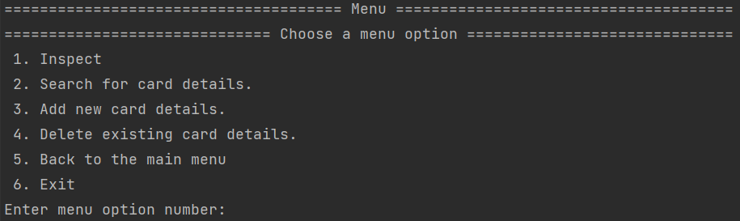
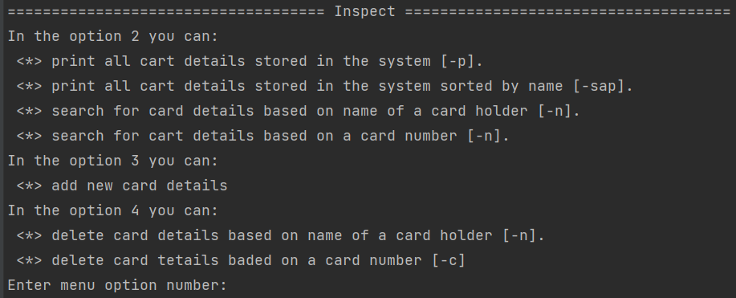
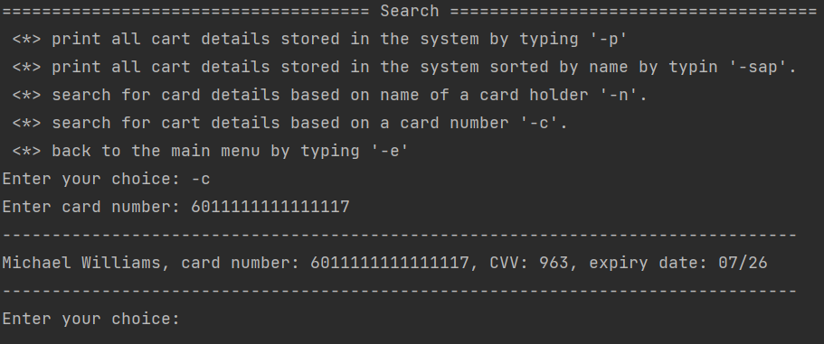
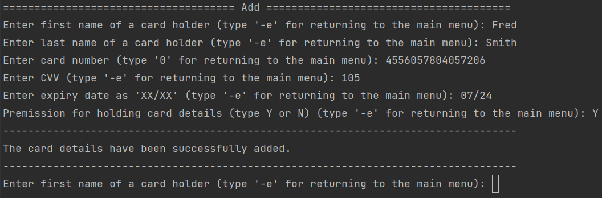
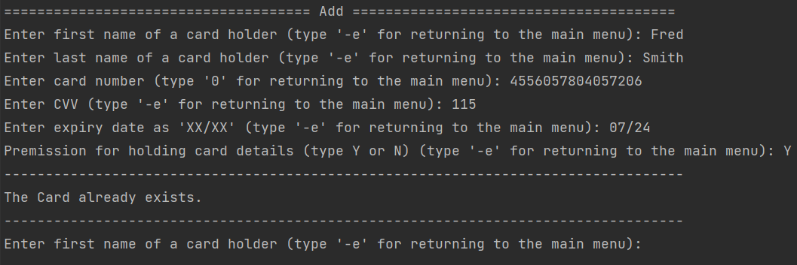
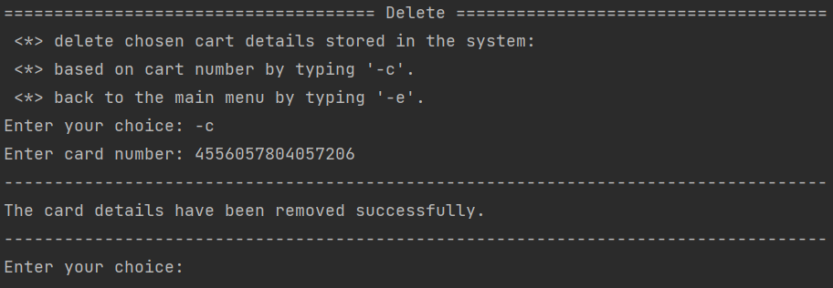
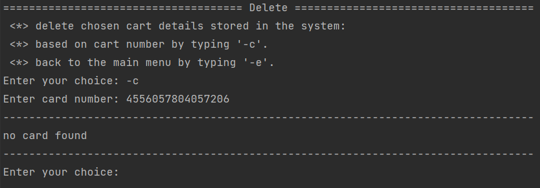
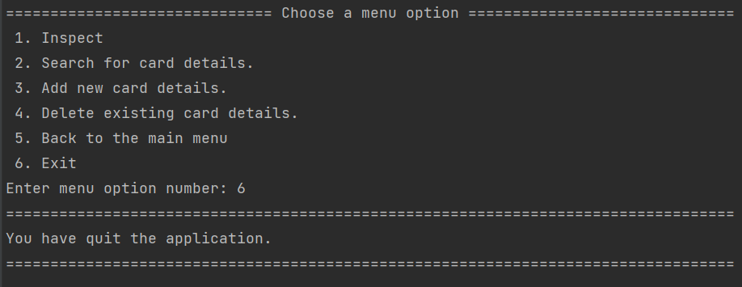

## Credit Card Validation and Storage - Assignment 2 (Univeristy of Essex)
************************************************************************

### Description:
This program stores and manages credit card details of customers who have
signed up to be regular customers in an online store. It has several 
functionalities like search and print, sort, add and delete chosen card
details. The program is used in a command line (terminal) via a navigation menu. 

### The Structure:
The program consists 8 files:
1) README.md - this file.
2) Card_calss.py - the file consists Card Class and Luhn algorithm.
3) data.csv - the file has initial data of 10 credit cards.
4) Data_validation.py - the file consists functions that test if data that
   are passed to the program are valid and right formatted.
5) main.py - the file consist the menu function and likens all functionalities
   form other files. This file initialises the program.
6) manage.py - This file consists all functions that build the functionalities'
   of the program (search, add, sort, delete, etc.)
7) sorting.py - The file consists the quick sort algorithm used in the program
8) Tests.py - The file consists several unittest to check the program.

### How to use the program

The program can be started from the command console by typing `main.py`. The 
main menu appears:

Now, a user can choose one of 6 options: Inspect the main menu content by typing 
`1`, Search by typing `2`, Add a new card to the program by typing `3`, Delete 
an existing card form the program by typing `4`, Back to the main menu by typing
`5` and finally Exit by typing `6`. 
#####Inspect
The inspect option navigates the user throughout the program:

From this level you can type only another main menu option (1-6).

#####Search

The search option has five commands. Typing `-p` results in printing out
all card details stored in the program. Typing `-sap` sorts by cardholder's 
name and prints out all card details. A user can also search for particular
details of a chosen card by name `-n` or by a card number `-c` (example below).
To go back to the main menu `-e` needs to be entered. 

#####Add

This section allowes for adding new card to the system. The user of the application
has to provided necessary data: first name of the card holder, surname of the 
cardholder, the card number, CVV, exapiry date and confirmation that a cardholder
wants to be a regular customer (`Y` or `N`). Typing `Y` is necessary to save the card
details. Otherwise, the program will not store details of this card.

If card details that are about to be added already exists, the program showes
appropriate information.

#####Delete

Delete function allows removing details of a chosen card selected by the 
card number. 

If the card is not stored, the program prints an appropriate message.

#####Back to the main menu and Exit

Command `5` prints the main menu again, and a user can choose another option.
Command `6`, however, ends the program.

### Unittests

In the file `Tests.py` there are several unittests to check if the main 
algorithms work correctly:
1) Unit test for the Luhn algorithm - the test passes either valid or invalid 
   card number. In the first case the the algorithm has to return `True` and for 
   the second case `False`.
2) Unit test for searching card details by name - the test passes details of a 
   card that are stored in the program, and different card details that are not 
   stored. In the first case the unittest compares graphical representation of 
   Card Class (`__repr__`) for these two instances. If they are the same the 
   test is passed. In the second case the program has to show info „Card not 
   found” to pass the test.
3) Unit test for searching card details by card number - Similarly to the 
   searching by name, card numbers are used. The test passes details of a card 
   that are stored in the program and card number that is not present in the 
   program. In the first case, again,  the unittest compares graphical 
   representation of Card Class for these two instances, if they are the same, 
   the test is passed. In the second case, the test is passes if the program 
   returns info „Card not found”.
4) Quick sort - for this test a list of random strings is generated (each string
   contains 4 characters) and it is sorted by quick sort algorithm and by python
   `sort()` function. The results of this two operations are compared. If the 
   results of these two methods are the same, the test is passed.  

